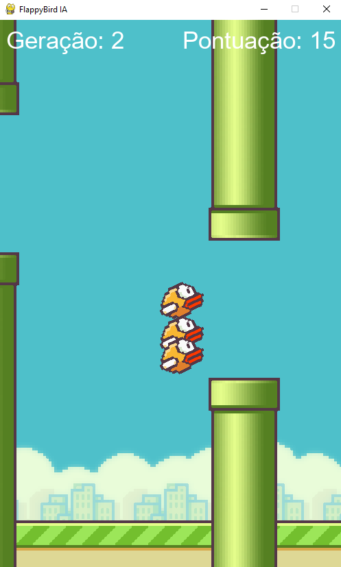
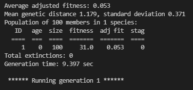

# FlappyBird jogado por uma Inteligência Artificial (NEAT)

<p align="center">

<br />Tela capturada durante a execução do programa
</p>

### Libs Usadas:
 - pygame
 - neat

### Descrição do projeto:
Foi recriado o jogo do FlappyBird usando o pygame, em seguida foram realizadas modificações para possibilitar a IA jogar, realizando adaptações em algumas partes do código para tal objetivo.

<p align="center">

</p>

A cada geração que é criada é retornado algumas informações sobre o desempenho dela no console. Normalmente ela consegue aprender a jogar perfeitamente por volta da segunda ou terceira geração, pois este jogo é bem simples.

### Execução:
```sh
$ python FlappyBirdManual.py
```